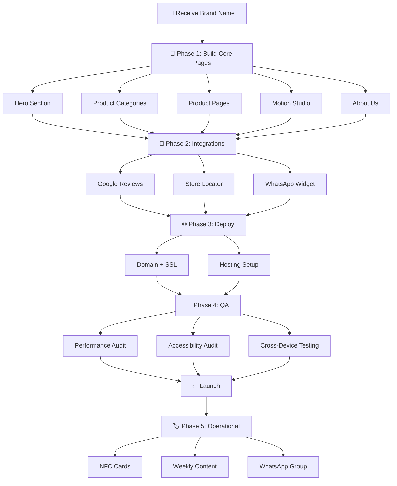

# 🏗️ Universal Website Implementation Plan

> **How to use**: Provide the **Brand Name** and this plan will serve as the master blueprint for building a premium, world-class website. Every section below is designed to be universally applicable across all client projects under Antigravity Clients.

---

## 📋 Project Overview

| Field | Value |
|---|---|
| **Brand Name** | `[BRAND_NAME]` |
| **Project Type** | Premium Business Website |
| **Design Intelligence** | Powered by `ui-ux-pro-max-mcp` (1,454 patterns, 54 categories) |
| **Tech Stack** | Next.js (React) or Vite + Vanilla JS (based on complexity) |
| **MCP Path** | `ui-ux-pro-max-mcp/` (cloned & built — ready to use) |

---

## 🎨 Design System Foundation (from UI/UX Pro Max MCP)

The entire design will be governed by the **1,454 UI/UX patterns** from the MCP knowledge base. Key categories we will draw from:

| Category | Patterns | What It Governs |
|---|---|---|
| **Color** | 161 patterns | Brand palette, WCAG contrast, CTA colors, dark/light mode |
| **Animation** | 32 patterns | Micro-interactions (150-300ms), easing curves, skeleton loaders |
| **Typography** | 6 core + 400+ font stack patterns | Font pairing, hierarchy, line-height, responsive sizing |
| **Layout** | 7 patterns | Z-index management, stacking context, content-shift prevention |
| **Navigation** | 6 patterns | Smooth scroll, sticky nav, active states, deep linking |
| **Responsive** | 8 patterns | Mobile-first, breakpoint testing, touch targets, viewport meta |
| **Performance** | 26 patterns | WebP/AVIF images, font-display, critical CSS, lazy loading |
| **Accessibility** | 25 patterns | 4.5:1 contrast, focus rings, ARIA labels, keyboard nav |
| **Interaction** | 8 patterns | Hover/active/disabled/focus states, loading buttons |
| **Forms** | 10 patterns | Input labels, inline validation, error placement, autofill |
| **Feedback** | 6 patterns | Loading indicators, empty states, toast notifications, progress |

---

## 📦 Phase 1: Foundation & Core Pages

### 1.1 — Hero Section
> Brand identity is the first impression. This section must **WOW** instantly.

| Element | Specification |
|---|---|
| **Brand Name & Logo** | Professionally designed logo, prominently placed |
| **Hero Layout** | Full-viewport height, immersive background (image/video/gradient) |
| **CTA Button** | High-contrast CTA with hover animation (ease-out, 200ms) |
| **Typography** | Display font (serif or geometric sans) for headline, system sans for body |
| **Animation** | Staggered fade-in on load (150-300ms per element per MCP `duration-timing`) |
| **Responsive** | Mobile-first stack layout, tablet 2-column, desktop full-width |

**MCP Patterns Used**: `color-contrast`, `duration-timing`, `easing`, `mobile-first`, `font-loading`

---

### 1.2 — Product Categories Page
> Showcase ALL product categories in a visually stunning, browseable grid.

| Element | Specification |
|---|---|
| **Layout** | CSS Grid — 1 col (mobile), 2 col (tablet), 3-4 col (desktop) |
| **Cards** | Each category gets a premium card with image, name, subtle hover scale (transform, not width/height per MCP `transform-performance`) |
| **Filtering** | Optional — category tabs or dropdown |
| **Images** | WebP/AVIF format, `srcset` for responsive, lazy-loaded below fold |
| **Animation** | Staggered grid entry animation, hover lift with shadow transition |

**MCP Patterns Used**: `image-optimization`, `image-dimension`, `transform-performance`, `hover-states`, `touch-friendly`

---

### 1.3 — Dedicated Product Pages
> Individual product pages with full detail — the money-making pages.

| Element | Specification |
|---|---|
| **Image Gallery** | Full-width hero image with thumbnail strip or carousel |
| **Product Info** | Name, description, specs table, price (if applicable) |
| **CTA** | "Enquire Now" / "Add to Cart" — high contrast, loading state on click |
| **Related Products** | Horizontal scroll section with 4-6 related items |
| **Breadcrumbs** | Full navigation breadcrumb trail |
| **SEO** | Unique `<title>`, `<meta description>`, structured data (JSON-LD) |

**MCP Patterns Used**: `loading-buttons`, `active-states`, `content-jumping`, `smooth-scroll`

---

### 1.4 — Interactive Motion Studio
> A **WOW factor** section — this differentiates us from every other basic website.

| Element | Specification |
|---|---|
| **Concept** | Interactive product showcase / 3D-style viewer / animated texture explorer |
| **Tech** | GSAP or Framer Motion for scroll-triggered animations |
| **Interactions** | Parallax scrolling, drag-to-explore, or hover-reveal effects |
| **Performance** | GPU-accelerated (transform/opacity only per MCP), `will-change` hints |
| **Fallback** | Reduced-motion media query for accessibility (`prefers-reduced-motion`) |

**MCP Patterns Used**: `transform-performance`, `excessive-motion`, `reduce-motion`, `gpu-compositing`

---

### 1.5 — About Us Page
> Tell the brand story with premium typography and emotional design.

| Element | Specification |
|---|---|
| **Story Section** | Rich typography with serif display font for headers |
| **Timeline** | Brand history in a visual timeline component |
| **Team** | Optional team grid with photos and roles |
| **Values** | Icon + text cards for core brand values |
| **Photography** | High-quality lifestyle/workspace imagery |

**MCP Patterns Used**: `line-height`, `line-length`, `font-size-scale`, `contrast-readability`

---

## 🔌 Phase 2: Integrations & Features

### 2.1 — Google Reviews Integration
| Element | Specification |
|---|---|
| **Implementation** | Google Places API or embedded widget |
| **Display** | Masonry/carousel layout with star ratings, reviewer name, review text |
| **Design** | Card-based with subtle shadow, star color accent matching brand |
| **Update** | Auto-refresh from Google — always shows latest reviews |
| **Fallback** | Graceful empty state if no reviews (per MCP `empty-states`) |

---

### 2.2 — Store Locator
| Element | Specification |
|---|---|
| **Map Provider** | Google Maps Embed API or Mapbox GL JS |
| **Features** | Interactive map with pin, store address, hours, phone number |
| **Directions** | "Get Directions" button linking to Google Maps |
| **Design** | Custom-styled map to match brand palette |
| **Responsive** | Full-width on mobile, split-view (map + info) on desktop |

---

### 2.3 — WhatsApp AI Agent Setup
| Element | Specification |
|---|---|
| **Chat Widget** | Floating WhatsApp button (bottom-right corner) |
| **Click Action** | Opens WhatsApp with pre-filled greeting message |
| **AI Agent** | Basic auto-responder for FAQs (product availability, store hours, location) |
| **Design** | Pulse animation on idle, smooth slide-in on hover |
| **Mobile** | Direct WhatsApp deep-link |

---

## 🏷️ Phase 3: Physical & Operational Assets

### 3.1 — NFC Review Card
| Element | Specification |
|---|---|
| **Card Design** | Premium card with brand logo, QR code fallback |
| **NFC Programming** | URL to Google Review page for the business |
| **Customer Flow** | Tap → Opens browser → Google Review form |

### 3.2 — Weekly Content Creation
| Element | Specification |
|---|---|
| **Photography** | Product shots on white/branded backgrounds |
| **Videography** | 15-30 sec product reels for social & website |
| **Frequency** | Weekly store visit |
| **Output** | Optimized for web (WebP), social (1080x1080, 9:16), and print |

### 3.3 — WhatsApp Support Group
| Element | Specification |
|---|---|
| **Purpose** | Weekly client updates, progress reports, content approvals |
| **Members** | Client team + Antigravity team |
| **Cadence** | Weekly status update every Monday |

---

## 🌐 Phase 4: Deployment & Infrastructure

### 4.1 — Domain Setup
| Element | Specification |
|---|---|
| **Domain** | `[brandname].shop` or `[brandname].store` |
| **Registrar** | Namecheap / GoDaddy / Cloudflare |
| **DNS** | Configured to point to hosting provider |

### 4.2 — SSL Certificate
| Element | Specification |
|---|---|
| **Type** | Let's Encrypt (free) or provider-bundled SSL |
| **Enforcement** | HTTP → HTTPS redirect enforced |
| **Validation** | Green padlock verified on all pages |

### 4.3 — Hosting & CI/CD
| Element | Specification |
|---|---|
| **Platform** | Vercel (for Next.js) or Netlify |
| **Build** | Auto-deploy from Git on push to `main` |
| **CDN** | Edge-cached globally for fast loading |

---

## 🧪 Phase 5: Quality Assurance & Verification

### 5.1 — Performance Audit
| Metric | Target | MCP Pattern |
|---|---|---|
| **Lighthouse Performance** | 90+ | `critical-css`, `image-optimization`, `lazy-loading` |
| **First Contentful Paint** | < 1.5s | `font-loading`, `font-preload` |
| **Cumulative Layout Shift** | < 0.1 | `image-dimension`, `content-jumping` |
| **Largest Contentful Paint** | < 2.5s | `image-optimization`, `preload` |

### 5.2 — Accessibility Audit
| Check | Standard | MCP Pattern |
|---|---|---|
| **Color Contrast** | WCAG AA (4.5:1) | `color-contrast` |
| **Focus Indicators** | 2-4px visible rings | `focus-states` |
| **Keyboard Navigation** | Full tab support | `keyboard-nav` |
| **Screen Reader** | Proper ARIA labels | `aria-labels` |
| **Reduced Motion** | `prefers-reduced-motion` | `reduce-motion` |

### 5.3 — Cross-Device Testing
| Device | Resolution | Notes |
|---|---|---|
| iPhone SE | 375×667 | Smallest modern mobile |
| iPhone 14 Pro | 393×852 | Standard iOS |
| Samsung Galaxy S24 | 360×780 | Standard Android |
| iPad | 768×1024 | Tablet |
| MacBook Air | 1440×900 | Laptop |
| Desktop | 1920×1080 | Full HD |

### 5.4 — Browser Testing
- Chrome (latest)
- Safari (latest)
- Firefox (latest)
- Edge (latest)
- Samsung Internet

---

## 📁 Project Directory Structure

```
[Brand_Name]/
├── website/                    # Main website source code
│   ├── public/                 # Static assets (images, fonts, favicons)
│   ├── src/
│   │   ├── components/         # Reusable UI components
│   │   │   ├── Hero/
│   │   │   ├── Navbar/
│   │   │   ├── ProductCard/
│   │   │   ├── CategoryGrid/
│   │   │   ├── ReviewCarousel/
│   │   │   ├── StoreLocator/
│   │   │   ├── WhatsAppWidget/
│   │   │   ├── MotionStudio/
│   │   │   └── Footer/
│   │   ├── pages/              # Page-level components
│   │   │   ├── index           # Home (Hero + Categories + Reviews)
│   │   │   ├── products/       # Product listing + individual pages
│   │   │   ├── about/          # About Us
│   │   │   ├── store-locator/  # Store Locator
│   │   │   └── motion-studio/  # Interactive Motion Studio
│   │   ├── styles/             # Global styles & design tokens
│   │   │   ├── globals.css     # CSS reset + custom properties
│   │   │   ├── tokens.css      # Color, spacing, typography tokens
│   │   │   └── animations.css  # Keyframes & transition utilities
│   │   └── utils/              # Helper functions
│   ├── package.json
│   └── next.config.js          # (or vite.config.js)
│
├── assets/                     # Photography & videography output
│   ├── products/
│   ├── lifestyle/
│   └── social/
│
├── nfc/                        # NFC card design files
│   └── review-card-design.md
│
└── docs/                       # Project documentation
    └── brand-guide.md
```

---

## 🚀 Execution Workflow



---

## ✅ Ready to Go

> **Just provide the Brand Name** and I will:
> 1. Clone this plan into the brand's project directory
> 2. Replace all `[BRAND_NAME]` placeholders
> 3. Select the appropriate color palette from the MCP's 161 color patterns
> 4. Begin building immediately following this blueprint

---

*Powered by [ui-ux-pro-max-mcp](https://github.com/rofuniki-coder/ui-ux-pro-max-mcp) — 1,454 design patterns • 54 categories • World-class UI/UX intelligence*
